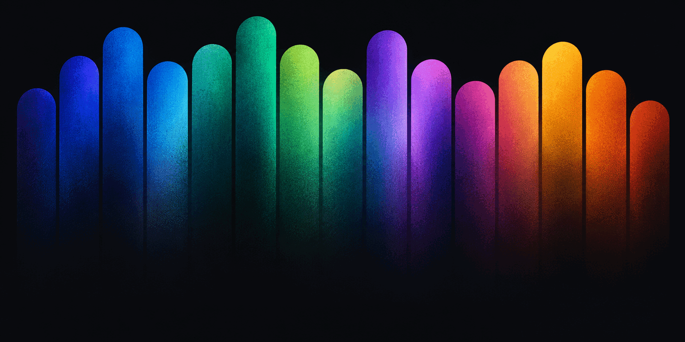

<p align="center">
  
</p>

# MApper

**Unified LCA · DSM/MFA · pLCA · AESA — a single workflow for system-level, time-resolved environmental sustainability analysis.**

[](LICENSE)
[](https://github.com/leofrht-jpg/MApper-Software/actions/workflows/ci.yml)
[](https://github.com/leofrht-jpg/MApper-Software/releases)
[](https://doi.org/10.5281/zenodo.22246255)

MApper is a desktop application that integrates **Life Cycle Assessment (LCA)**, **Dynamic Stock Modelling / Material Flow Analysis (DSM/MFA)**, **prospective LCA (pLCA)**, and **Absolute Environmental Sustainability Assessment (AESA)** in one workflow. It is built for researchers who need to evaluate the environmental impact of evolving material systems over time and against planetary boundaries.

**Website:** [mapper.leonardoferhati.com](https://mapper.leonardoferhati.com)

---

## Why MApper

These four methods are usually run in separate tools, by hand, with brittle data hand-offs between them. The integration is where the scientific value sits — and where the work disappears today.

- **LCA** tells you the impact of a product.
- **DSM/MFA** tells you how a *stock* of products and its material flows evolve over time.
- **pLCA** tells you how background impacts shift under future energy scenarios.
- **AESA** tells you whether the resulting impact is *absolutely* sustainable — i.e. within a fair share of planetary boundaries.

MApper couples all four in one **cohort-preserving** pipeline: a time-resolved material flow feeds time-matched prospective inventories, which produce year-by-year impacts, which are assessed against an assigned fair share of the planetary boundaries (Sustainability Ratios). One model, one data path, no manual stitching — every product cohort keeps its identity (fuel type, size, birth year) from LCA → pLCA → DSM/MFA → AESA. That four-method integration is MApper's reason to exist.

**Reference study:** the **Danish passenger-car fleet, 2025–2050** — a full LCA → prospective-LCA → DSM/MFA → AESA run on an evolving vehicle stock under SSP scenarios. MApper is general-purpose, though: the same pipeline applies to wind turbines, buildings, electronics, food systems, or any other evolving product system.

## Features

- **LCA Engine** — Brightway2 integration with ecoinvent 3.10. Multi-method LCIA
  with contribution analysis, treemaps, and Sankey diagrams; multi-archetype
  comparison with per-stage breakdown. Results are addressed by the full method
  tuple, so indicators sharing a display name stay distinct everywhere — EF v3.1
  has four indicators called "global warming potential (GWP100)".

- **Uncertainty — Monte Carlo propagation** — Over the **background**
  (technosphere, biosphere and characterisation factors, resampled by `bw2calc`
  each iteration), the **foreground** (BOM quantities and parameter expressions,
  resampled per iteration — parameters are drawn once and expressions re-resolved
  against the draw, so a shared driver stays correlated instead of averaging
  away), and per-row uncertainty scored with the **pedigree matrix**, with a
  reusable material pedigree library.

  **Comparisons use paired sampling, and only paired sampling:** one sampled
  world per iteration, every compared system solved against it, so a driver two
  systems share cancels in their difference instead of inflating it. Sampling the
  systems independently can report "not distinguishable" where the paired run
  finds a consistent difference.

- **Authored databases** *(new in 0.3.0)* — Create your own Brightway database
  inside MApper and author activities in it from **biosphere flows**: a process
  whose impact is its direct emissions, or a supplier's cradle-to-gate figure
  entered as one characterised value. Authored activities link into a Bill of
  Materials like any ecoinvent activity. Supporting this:
  - a **compartment picker** that groups biosphere flows by substance and shows,
    per compartment, what each method's characterisation factor actually is —
    choosing NOx to urban air versus high stacks is a decision, not a guess;
  - **uncertainty discipline** — every exchange is lognormal with all five
    pedigree scores required, its basic variance defaults to ecoinvent's median
    for that flow, and a GSD² below ecoinvent's median for the same flow must
    carry a written reason. You cannot silently claim your data is tighter than
    ecoinvent's;
  - an **uncertainty basis** per exchange, for the case where the amount is not
    an emission but someone else's characterised result. It asks for *more* than
    the default — a variance and its source — and the basis follows the number
    into every result and workbook, so a reader comparing two GSD² values is
    told when they describe different quantities.

- **Dynamic Stock Modelling** — Cohort-based stock dynamics with Weibull survival
  and system-level projections. Material flow quantification grouped by material,
  component, stage, or archetype. Named DSM scenarios, scaling rules and survival
  configurations; **subsystems** with dependency rules, so one stock can drive
  another (vehicles driving chargers).

- **Parameters** — Drive BOM quantities with named parameters and expressions
  instead of literals, and vary them as named **scenarios** and sensitivity cases
  in one run. A scenario says *which values*, never whether to resolve.

- **Prospective LCA** — premise integration for 6 IAMs (REMIND, REMIND-EU, IMAGE,
  MESSAGE, GCAM, TIAM-UCL) × SSP1–5 scenarios. Year-matched background databases.

- **AESA** — Planetary-boundary assessment with customizable sharing principles
  and an explicit downscaling chain, each layer carrying its own source string
  into the export. Radar charts positioning your system relative to the safe
  operating space.

- **Archetype System** — Hierarchical Bills of Materials with ecoinvent linking,
  folder organization, material evolution modeling (learning rates, milestones,
  rebound effects), and **composition** — an archetype can be a component of
  another.

- **LCIA Method Library** — Install additional method packages (IMPACT World+,
  LC-IMPACT) or your own characterisation factors from an Excel sheet.

- **Impact Assessment** — Stage-aware scope filtering (Manufacturing→inflows,
  Operation→stock, End of Life→outflows). Multi-indicator calculation (one
  technosphere solve per year, all indicators via characterisation-matrix
  switching), UMFPACK factorisation reuse (the premise db for each year is
  factorised once and back-substituted for every subsequent solve).
  Comprehensive Excel export — every workbook that reports impact or
  sustainability-ratio values carries a **Coverage sheet** naming each indicator
  it reports as specified, not specified, or not recorded.

- **Projects** — Create, switch, duplicate, rename and delete projects; export and
  import them. A project export is **modelling-only by default**: your archetypes,
  parameters, DSM systems and authored databases travel, licensed inventory data
  does not.

### What MApper does not claim

Two constraints are design decisions, and the software states them rather than
papering over them.

**Authored activities are biosphere-only in v1.** You can specify elementary
flows; you cannot give an authored activity a technosphere input. That is
deliberate: a technosphere link would not be translated into a prospective
background, so an authored activity would silently keep base-year electricity
in every future year of a prospective run. An authored activity therefore
reports the emissions you entered, and nothing about its supply chain.

**A partial inventory's uncovered indicators are marked "not specified", never
reported as zero.** When you declare an authored activity partial, you also
declare which indicators it is complete for. Every result and every workbook
that used it marks the rest as unknown rather than reporting a number that would
read as "no impact" — because a flow you did not enter is not a flow that does
not exist. An AESA axis fed by such a result is hatched and its Sustainability
Ratio is reported as a lower bound.

## Architecture

- **Frontend:** React + Vite + TypeScript + Tailwind CSS
- **Backend:** FastAPI + Python 3.11
- **LCA engine:** Brightway2 + bw2calc with UMFPACK factorisation reuse — each premise db is factorised once and back-substituted for every subsequent solve. UMFPACK is bundled in the desktop build via `mapper-desktop.spec`, so the shipped app always gets this path: the Danish fleet case (3 LCI scenarios × 26 years × 25 indicators) completes in **under a minute**, down from ≈ 54 minutes. See DESKTOP.md → "UMFPACK in the frozen build"
- **DSM engine:** Cohort-based dynamic stock model with Weibull survival
- **Prospective:** premise 2.1.3
- **Desktop packaging:** Tauri v2

## Quickstart

### Prerequisites

- [Miniconda](https://docs.conda.io/en/latest/miniconda.html) or Anaconda
- [Node.js 18+](https://nodejs.org)
- An ecoinvent 3.10 license and `.7z` file (cutoff system model) — see note below

### Install & run

```bash
git clone https://github.com/leofrht-jpg/MApper-Software.git
cd MApper-Software

conda env create -f environment.yml   # pinned environment; the one CI uses
conda activate map

# macOS/Linux only — the sparse solver that makes prospective LCA fast.
# Not in environment.yml because conda-forge has no Windows build.
conda install -c conda-forge scikit-umfpack=0.3.3 suitesparse

( cd mapper-frontend && npm ci )

./start.sh        # starts backend (FastAPI) + frontend (Vite)
```

> `./setup.sh` (or `setup.bat` on Windows) runs exactly these steps if you
> prefer one command. It will not modify an existing `map` environment —
> use `./setup.sh --force` to recreate one.

Open [http://localhost:5173](http://localhost:5173).

### Try it without ecoinvent

**MApper works out of the box with no licence.** ecoinvent is separately
licensed and is never bundled, so a fresh install has no life-cycle inventory
data. Rather than leave you with nothing to run, MApper ships a demo project
built from synthetic data:

```bash
cd mapper-backend
python scripts/load_demo_project.py --verify
```

or, in the app, open **Database Explorer** and click
**"Load demo project (no licence needed)"**.

The first run takes about 10 seconds and needs ~150 MB of disk: it installs
`biosphere3` and 762 LCIA methods, which ship inside `bw2io` and carry no
licence restriction. Re-running is a no-op (~2 s).

**What the demo gives you** — a 31-year (2020–2050) passenger-vehicle fleet with
battery-electric and combustion cohorts, and everything downstream of it:

| Step | What you can verify |
| --- | --- |
| **DSM Modeller** | Cohort-tracked stock, inflows and outflows over 31 years, Weibull survival |
| **LCA Architect** | Two bills of materials linked to the synthetic database |
| **Impact Assessment** | A real `bw2calc` solve — real elementary flows, real IPCC characterisation factors |
| **AESA** | Impact results downscaled against planetary boundaries |

That covers the DSM → material flows → LCA → AESA integration, which is the
part of MApper the paper argues is novel.

> [!WARNING]
> **Every number in the demo is fictional.** The inventory is invented — chosen
> so charts have sensible proportions, and wrong. The LCA arithmetic is real;
> the data it consumes is not. A red banner stays on screen for as long as the
> demo project is active. **Do not cite, publish or present any demo output as
> an environmental assessment.**

The demo lives in its own Brightway2 project (`MApper demo (synthetic data)`)
and touches nothing else. Delete that project to remove it.

**What still needs a licence:** a real assessment needs your own ecoinvent
database, and prospective (premise) analysis needs both ecoinvent and a premise
key. The demo covers neither — it demonstrates that the software works, not
what any real system emits.

### Example: first analysis

*This is the workflow with a real ecoinvent licence. Without one, use
**Try it without ecoinvent** above.*

1. **Database Explorer** → import your ecoinvent `.7z` file (~10 min).
2. *(Optional)* **pLCA Developer** → generate prospective databases (requires a premise key).
3. **LCA Architect** → import or create archetypes (Bills of Materials).
4. **DSM Modeller** → upload stock + inflows data.
5. **Impact Assessment** → set cohort mappings → calculate.
6. *(Optional)* **AESA** → compare impacts against planetary boundaries.

> **Prospective LCA** requires a premise encryption key. Email `romain.sacchi@psi.ch` for a key, then `mkdir -p ~/.premise && echo 'YOUR_KEY' > ~/.premise/premise_key`.

Full instructions are in [INSTALL.md](INSTALL.md).

## System requirements

|         | Minimum                               | Recommended                  |
| ------- | ------------------------------------- | ---------------------------- |
| RAM     | 8 GB                                  | 16 GB                        |
| Disk    | 5 GB                                  | 15 GB (with prospective DBs) |
| OS      | macOS 13+, Windows 10+, Ubuntu 22.04+ |                              |
| Python  | 3.11                                  | 3.11                         |
| Node.js | 18                                    | 20+                          |

## Commercial use

**MApper is free for everyone, including for commercial use**, under the
[Mozilla Public License 2.0](LICENSE). You can use it in companies, consulting
work, and commercial research without a fee. The MPL applies file-level
copyleft: if you modify MApper's own source files and distribute them, those
modified files must remain under MPL 2.0 — but you may combine MApper with
proprietary code in a larger work.

<!-- DRAFT — DO NOT PUBLISH until the DTU secondary-employment arrangement is in
place (contact: Frida, dept. innovation). The paid-services menu below must NOT
be rendered/advertised before that arrangement exists. Keep this entire block
inside this HTML comment.

DTU may offer optional paid services around MApper for organizations that want
support beyond the open-source project:

- Training and certification — workshops and certified user/practitioner programs.
- Consulting — applied LCA/DSM/pLCA/AESA studies using MApper.
- Custom development — bespoke features, connectors, and methods.
- Support contracts — prioritized support and SLAs.
- Hosted SaaS — managed cloud deployment.
- Commercial extensions — closed-source add-ons.

Commercial-services contact (once live): leo_frht@icloud.com · /commercial page on the website.
END DRAFT -->

For general inquiries: **[leo_frht@icloud.com](mailto:leo_frht@icloud.com)**.

## Contributing

Contributions are welcome and are accepted under MPL 2.0 with DTU as the
copyright holder. Please read [CONTRIBUTING.md](CONTRIBUTING.md) and our
[Code of Conduct](CODE_OF_CONDUCT.md) before opening a pull request. Security
issues: see [SECURITY.md](SECURITY.md).

## Citation

If you use MApper in your research, please cite it. The DOI below is the
Zenodo **concept DOI**: it always resolves to the latest archived release, so a
citation using it stays valid as MApper is updated. A JOSS (Journal of Open
Source Software) paper is in preparation.

```bibtex
@software{ferhati_mapper_2026,
  author    = {Ferhati, Leonardo},
  title     = {MApper: A unified platform for Life Cycle Assessment,
               Dynamic Stock Modelling, prospective LCA, and Absolute
               Environmental Sustainability Assessment},
  year       = {2026},
  publisher  = {Technical University of Denmark},
  url        = {https://mapper.leonardoferhati.com},
  doi        = {10.5281/zenodo.22246255},
  note       = {Archived on Zenodo; this DOI resolves to the latest release. JOSS paper in preparation}
}
```

> The DOI is the concept DOI and needs no updating between releases. Add the
> JOSS citation alongside it once the paper is published.

## Copyright and license

**© Copyright 2026 Technical University of Denmark**

- **Copyright holder:** Technical University of Denmark (DTU).
- **Lead developer:** Leonardo Ferhati.
- **License:** Mozilla Public License 2.0 (MPL-2.0). Full text in [LICENSE](LICENSE).

MApper depends on third-party open-source software, each under its own license —
see [NOTICE](NOTICE) and [THIRD_PARTY_LICENSES.md](THIRD_PARTY_LICENSES.md).
The ecoinvent database and IAM scenario data are separately licensed and are
**not** distributed with MApper; users must supply their own licensed data.

## Contact

- **Project & commercial inquiries:** [leo_frht@icloud.com](mailto:leo_frht@icloud.com)
- **Website:** [mapper.leonardoferhati.com](https://mapper.leonardoferhati.com)
- **Developer:** [leonardoferhati.com](https://leonardoferhati.com)
